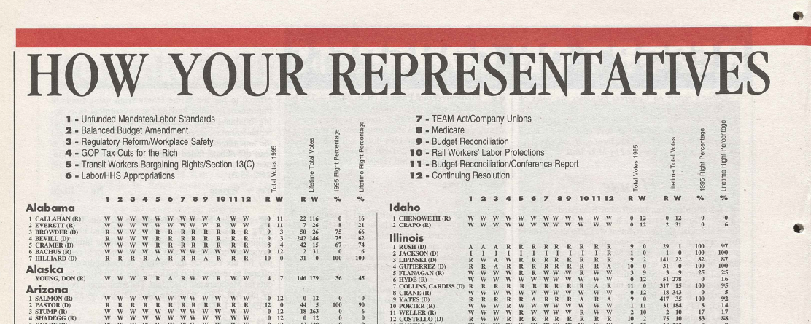

# AFL-CIO Legislative Scoreboards

  
  
  
  

  

  <em>Example AFL-CIO legislative scoreboard (archival scan)</em>

---

# AFL-CIO Legislative Scoreboards

  
  
  
  

---

This repository provides AFL-CIO **legislative scoreboards** of the U.S. House between 1980 and 2025. In particular, it provides (1) data on AFL-CIO–selected bills and (2) R code to score legislators’ behavior on those votes.

> **Status:** Extension to additional years and the U.S. Senate is ongoing.

---

## Download

For each year, the repository provides a bill-level `.xlsx` dataset and, when available, the corresponding AFL-CIO scorecard `.pdf`.

### Full dataset

| File | Description | Download |
|---|---|---|
| `bills.xlsx` | Complete pooled House dataset for all available AFL-CIO scoreboards, 1980–2025. | [Download](https://raw.githubusercontent.com/nicolas-izquierdo/afl_cio_scoreboards/main/HOUSE/bills.xlsx) |

### Yearly dataset

<strong>1980s</strong>

| Year | Dataset | Scorecard |
|---|---|---|
| 1980 | [XLSX](https://raw.githubusercontent.com/nicolas-izquierdo/afl_cio_scoreboards/main/HOUSE/1980/aflcio_house_votes_1980.xlsx) | [PDF](https://raw.githubusercontent.com/nicolas-izquierdo/afl_cio_scoreboards/main/HOUSE/1980/scoreboard_1980.pdf) |
| 1981 | [XLSX](https://raw.githubusercontent.com/nicolas-izquierdo/afl_cio_scoreboards/main/HOUSE/1981/aflcio_house_votes_1981.xlsx) | [PDF](https://raw.githubusercontent.com/nicolas-izquierdo/afl_cio_scoreboards/main/HOUSE/1981/scoreboard_1981.pdf) |
| 1982 | [XLSX](https://raw.githubusercontent.com/nicolas-izquierdo/afl_cio_scoreboards/main/HOUSE/1982/aflcio_house_votes_1982.xlsx) | [PDF](https://raw.githubusercontent.com/nicolas-izquierdo/afl_cio_scoreboards/main/HOUSE/1982/scoreboard_1982.pdf) |
| 1983 | [XLSX](https://raw.githubusercontent.com/nicolas-izquierdo/afl_cio_scoreboards/main/HOUSE/1983/aflcio_house_votes_1983.xlsx) | [PDF](https://raw.githubusercontent.com/nicolas-izquierdo/afl_cio_scoreboards/main/HOUSE/1983/scoreboard_1983.pdf) |
| 1984 | [XLSX](https://raw.githubusercontent.com/nicolas-izquierdo/afl_cio_scoreboards/main/HOUSE/1984/aflcio_house_votes_1984.xlsx) | [PDF](https://raw.githubusercontent.com/nicolas-izquierdo/afl_cio_scoreboards/main/HOUSE/1984/scoreboard_1984.pdf) |
| 1985 | [XLSX](https://raw.githubusercontent.com/nicolas-izquierdo/afl_cio_scoreboards/main/HOUSE/1985/aflcio_house_votes_1985.xlsx) | [PDF](https://raw.githubusercontent.com/nicolas-izquierdo/afl_cio_scoreboards/main/HOUSE/1985/scoreboard_1985.pdf) |
| 1986 | [XLSX](https://raw.githubusercontent.com/nicolas-izquierdo/afl_cio_scoreboards/main/HOUSE/1986/aflcio_house_votes_1986.xlsx) | [PDF](https://raw.githubusercontent.com/nicolas-izquierdo/afl_cio_scoreboards/main/HOUSE/1986/scoreboard_1986.pdf) |
| 1987 | [XLSX](https://raw.githubusercontent.com/nicolas-izquierdo/afl_cio_scoreboards/main/HOUSE/1987/aflcio_house_votes_1987.xlsx) | [PDF](https://raw.githubusercontent.com/nicolas-izquierdo/afl_cio_scoreboards/main/HOUSE/1987/scoreboard_1987.pdf) |
| 1988 | [XLSX](https://raw.githubusercontent.com/nicolas-izquierdo/afl_cio_scoreboards/main/HOUSE/1988/aflcio_house_votes_1988.xlsx) | [PDF](https://raw.githubusercontent.com/nicolas-izquierdo/afl_cio_scoreboards/main/HOUSE/1988/scoreboard_1988.pdf) |
| 1989 | [XLSX](https://raw.githubusercontent.com/nicolas-izquierdo/afl_cio_scoreboards/main/HOUSE/1989/aflcio_house_votes_1989.xlsx) | [PDF](https://raw.githubusercontent.com/nicolas-izquierdo/afl_cio_scoreboards/main/HOUSE/1989/scoreboard_1989.pdf) |

<strong>1990s</strong>

| Year | Dataset | Scorecard |
|---|---|---|
| 1990 | [XLSX](https://raw.githubusercontent.com/nicolas-izquierdo/afl_cio_scoreboards/main/HOUSE/1990/aflcio_house_votes_1990.xlsx) | [PDF](https://raw.githubusercontent.com/nicolas-izquierdo/afl_cio_scoreboards/main/HOUSE/1990/scoreboard_1990.pdf) |
| 1991 | [XLSX](https://raw.githubusercontent.com/nicolas-izquierdo/afl_cio_scoreboards/main/HOUSE/1991/aflcio_house_votes_1991.xlsx) | [PDF](https://raw.githubusercontent.com/nicolas-izquierdo/afl_cio_scoreboards/main/HOUSE/1991/scoreboard_1991.pdf) |
| 1992 | [XLSX](https://raw.githubusercontent.com/nicolas-izquierdo/afl_cio_scoreboards/main/HOUSE/1992/aflcio_house_votes_1992.xlsx) | [PDF](https://raw.githubusercontent.com/nicolas-izquierdo/afl_cio_scoreboards/main/HOUSE/1992/scoreboard_1992.pdf) |
| 1993 | [XLSX](https://raw.githubusercontent.com/nicolas-izquierdo/afl_cio_scoreboards/main/HOUSE/1993/aflcio_house_votes_1993.xlsx) | [PDF](https://raw.githubusercontent.com/nicolas-izquierdo/afl_cio_scoreboards/main/HOUSE/1993/scoreboard_1993.pdf) |
| 1994 | [XLSX](https://raw.githubusercontent.com/nicolas-izquierdo/afl_cio_scoreboards/main/HOUSE/1994/aflcio_house_votes_1994.xlsx) | [PDF](https://raw.githubusercontent.com/nicolas-izquierdo/afl_cio_scoreboards/main/HOUSE/1994/scoreboard_1994.pdf) |
| 1995 | [XLSX](https://raw.githubusercontent.com/nicolas-izquierdo/afl_cio_scoreboards/main/HOUSE/1995/aflcio_house_votes_1995.xlsx) | [PDF](https://raw.githubusercontent.com/nicolas-izquierdo/afl_cio_scoreboards/main/HOUSE/1995/scoreboard_1995.pdf) |
| 1996 | [XLSX](https://raw.githubusercontent.com/nicolas-izquierdo/afl_cio_scoreboards/main/HOUSE/1996/aflcio_house_votes_1996.xlsx) | [PDF](https://raw.githubusercontent.com/nicolas-izquierdo/afl_cio_scoreboards/main/HOUSE/1996/scoreboard_1996.pdf) |
| 1997 | [XLSX](https://raw.githubusercontent.com/nicolas-izquierdo/afl_cio_scoreboards/main/HOUSE/1997/aflcio_house_votes_1997.xlsx) | [PDF](https://raw.githubusercontent.com/nicolas-izquierdo/afl_cio_scoreboards/main/HOUSE/1997/scoreboard_1997.pdf) |
| 1998 | [XLSX](https://raw.githubusercontent.com/nicolas-izquierdo/afl_cio_scoreboards/main/HOUSE/1998/aflcio_house_votes_1998.xlsx) | [PDF](https://raw.githubusercontent.com/nicolas-izquierdo/afl_cio_scoreboards/main/HOUSE/1998/scoreboard_1998.pdf) |
| 1999 | [XLSX](https://raw.githubusercontent.com/nicolas-izquierdo/afl_cio_scoreboards/main/HOUSE/1999/aflcio_house_votes_1999.xlsx) | [PDF](https://raw.githubusercontent.com/nicolas-izquierdo/afl_cio_scoreboards/main/HOUSE/1999/scoreboard_1999.pdf) |

<strong>2000s</strong>

| Year | Dataset | Scorecard |
|---|---|---|
| 2000 | [XLSX](https://raw.githubusercontent.com/nicolas-izquierdo/afl_cio_scoreboards/main/HOUSE/2000/aflcio_house_votes_2000.xlsx) | [PDF](https://raw.githubusercontent.com/nicolas-izquierdo/afl_cio_scoreboards/main/HOUSE/2000/scoreboard_2000.pdf) |
| 2001 | [XLSX](https://raw.githubusercontent.com/nicolas-izquierdo/afl_cio_scoreboards/main/HOUSE/2001/aflcio_house_votes_2001.xlsx) | [PDF](https://raw.githubusercontent.com/nicolas-izquierdo/afl_cio_scoreboards/main/HOUSE/2001/scoreboard_2001.pdf) |
| 2002 | [XLSX](https://raw.githubusercontent.com/nicolas-izquierdo/afl_cio_scoreboards/main/HOUSE/2002/aflcio_house_votes_2002.xlsx) | [PDF](https://raw.githubusercontent.com/nicolas-izquierdo/afl_cio_scoreboards/main/HOUSE/2002/scoreboard_2002.pdf) |
| 2003 | [XLSX](https://raw.githubusercontent.com/nicolas-izquierdo/afl_cio_scoreboards/main/HOUSE/2003/aflcio_house_votes_2003.xlsx) | [PDF](https://raw.githubusercontent.com/nicolas-izquierdo/afl_cio_scoreboards/main/HOUSE/2003/scoreboard_2003.pdf) |
| 2004 | [XLSX](https://raw.githubusercontent.com/nicolas-izquierdo/afl_cio_scoreboards/main/HOUSE/2004/aflcio_house_votes_2004.xlsx) | [PDF](https://raw.githubusercontent.com/nicolas-izquierdo/afl_cio_scoreboards/main/HOUSE/2004/scoreboard_2004.pdf) |
| 2005 | [XLSX](https://raw.githubusercontent.com/nicolas-izquierdo/afl_cio_scoreboards/main/HOUSE/2005/aflcio_house_votes_2005.xlsx) | [PDF](https://raw.githubusercontent.com/nicolas-izquierdo/afl_cio_scoreboards/main/HOUSE/2005/scoreboard_2005.pdf) |
| 2006 | [XLSX](https://raw.githubusercontent.com/nicolas-izquierdo/afl_cio_scoreboards/main/HOUSE/2006/aflcio_house_votes_2006.xlsx) | [PDF](https://raw.githubusercontent.com/nicolas-izquierdo/afl_cio_scoreboards/main/HOUSE/2006/scoreboard_2006.pdf) |
| 2007 | [XLSX](https://raw.githubusercontent.com/nicolas-izquierdo/afl_cio_scoreboards/main/HOUSE/2007/aflcio_house_votes_2007.xlsx) | [PDF](https://raw.githubusercontent.com/nicolas-izquierdo/afl_cio_scoreboards/main/HOUSE/2007/scoreboard_2007.pdf) |
| 2008 | [XLSX](https://raw.githubusercontent.com/nicolas-izquierdo/afl_cio_scoreboards/main/HOUSE/2008/aflcio_house_votes_2008.xlsx) | [PDF](https://raw.githubusercontent.com/nicolas-izquierdo/afl_cio_scoreboards/main/HOUSE/2008/scoreboard_2008.pdf) |
| 2009 | [XLSX](https://raw.githubusercontent.com/nicolas-izquierdo/afl_cio_scoreboards/main/HOUSE/2009/aflcio_house_votes_2009.xlsx) | — |

<strong>2010s</strong>

| Year | Dataset | Scorecard |
|---|---|---|
| 2010 | [XLSX](https://raw.githubusercontent.com/nicolas-izquierdo/afl_cio_scoreboards/main/HOUSE/2010/aflcio_house_votes_2010.xlsx) | — |
| 2011 | [XLSX](https://raw.githubusercontent.com/nicolas-izquierdo/afl_cio_scoreboards/main/HOUSE/2011/aflcio_house_votes_2011.xlsx) | — |
| 2012 | [XLSX](https://raw.githubusercontent.com/nicolas-izquierdo/afl_cio_scoreboards/main/HOUSE/2012/aflcio_house_votes_2012.xlsx) | — |
| 2013 | [XLSX](https://raw.githubusercontent.com/nicolas-izquierdo/afl_cio_scoreboards/main/HOUSE/2013/aflcio_house_votes_2013.xlsx) | — |
| 2014 | [XLSX](https://raw.githubusercontent.com/nicolas-izquierdo/afl_cio_scoreboards/main/HOUSE/2014/aflcio_house_votes_2014.xlsx) | — |
| 2015 | [XLSX](https://raw.githubusercontent.com/nicolas-izquierdo/afl_cio_scoreboards/main/HOUSE/2015/aflcio_house_votes_2015.xlsx) | — |
| 2016 | [XLSX](https://raw.githubusercontent.com/nicolas-izquierdo/afl_cio_scoreboards/main/HOUSE/2016/aflcio_house_votes_2016.xlsx) | — |
| 2017 | [XLSX](https://raw.githubusercontent.com/nicolas-izquierdo/afl_cio_scoreboards/main/HOUSE/2017/aflcio_house_votes_2017.xlsx) | — |
| 2018 | [XLSX](https://raw.githubusercontent.com/nicolas-izquierdo/afl_cio_scoreboards/main/HOUSE/2018/aflcio_house_votes_2018.xlsx) | — |
| 2019 | [XLSX](https://raw.githubusercontent.com/nicolas-izquierdo/afl_cio_scoreboards/main/HOUSE/2019/aflcio_house_votes_2019.xlsx) | — |

<strong>2020s</strong>

| Year | Dataset | Scorecard |
|---|---|---|
| 2020 | [XLSX](https://raw.githubusercontent.com/nicolas-izquierdo/afl_cio_scoreboards/main/HOUSE/2020/aflcio_house_votes_2020.xlsx) | — |
| 2021 | [XLSX](https://raw.githubusercontent.com/nicolas-izquierdo/afl_cio_scoreboards/main/HOUSE/2021/aflcio_house_votes_2021.xlsx) | — |
| 2022 | [XLSX](https://raw.githubusercontent.com/nicolas-izquierdo/afl_cio_scoreboards/main/HOUSE/2022/aflcio_house_votes_2022.xlsx) | — |
| 2023 | [XLSX](https://raw.githubusercontent.com/nicolas-izquierdo/afl_cio_scoreboards/main/HOUSE/2023/aflcio_house_votes_2023.xlsx) | — |
| 2024 | [XLSX](https://raw.githubusercontent.com/nicolas-izquierdo/afl_cio_scoreboards/main/HOUSE/2024/aflcio_house_votes_2024.xlsx) | — |
| 2025 | [XLSX](https://raw.githubusercontent.com/nicolas-izquierdo/afl_cio_scoreboards/main/HOUSE/2025/aflcio_house_votes_2025.xlsx) | — |

---

## Data Construction

The dataset is constructed in three steps:

1. AFL-CIO legislative scorecards are collected and transcribed using Claude Code
2. Each vote is matched to its corresponding VoteView roll call
3. Roll call metadata are retrieved from VoteView

---

## Sources

Relevant data are drawn from:

- 📄 AFL-CIO publications (current and archived versions via the [Wayback Machine](https://web.archive.org/))
- 📰 Historical issues of *AFL-CIO News* available at the [Internet Archive AFL-CIO News collection](https://archive.org/search?query=creator%3A%22AFL-CIO%22+%22news%22)
- 🗳️ [Clerk of the House](https://clerk.house.gov)
- 📊 [VoteView](https://voteview.com)

---

## Coverage

| Period | Congresses | Files | Votes |
|---|---|---|---|
| 1980–1989 | H096–H101 | 10 | 157 |
| 1990–1999 | H101–H106 | 10 | 107 |
| 2000–2009 | H106–H111 | 10 | 140 |
| 2010–2019 | H111–H116 | 10 | 178 |
| 2020–2025 | H116–H119 | 6 | 130 |
| **Total** | **H096–H119** | **46** | **712** |

---

## Data Structure

The dataset provides bill-level information linking AFL-CIO scorecards to VoteView records.

| Variable | Type | Description |
|---|---|---|
| `congress` | integer | U.S. Congress number (e.g. `96` = 96th Congress, 1979–1981). |
| `year` | integer | AFL-CIO scorecard year. Note: some votes in a scorecard year occurred in the prior calendar year. |
| `aflcio_num` | integer | AFL-CIO sequential vote number within the annual scorecard. |
| `rollcall` | integer | Official Clerk of the House roll call number. Resets to 1 each calendar year. |
| `vv_rollnumber` | integer | VoteView roll call number linked to the AFL-CIO vote entry. In most cases this coincides with the official House roll call number. |
| `date` | datetime | Date the vote was held on the House floor. |
| `chamber` | string | Chamber (`"House"` or `"Senate"`). |
| `bill_type` | string | Official bill type (e.g. `H.R.`, `H.J.Res.`, `H.Con.Res.`, `H.Res.`, `S.`, `S.J.Res.`, `S.Con.Res.`). |
| `bill_number` | string | Numeric part of the bill number (e.g. `800` for `H.R. 800`). |
| `bill_title` | string | AFL-CIO’s descriptive title for the vote. |
| `bill_id` | string | Concatenation of `bill_type` and `bill_number` in compact form (e.g. `HR5980`). |
| `question` | string | Official vote question or Clerk description associated with the roll call. |
| `amendment_author` | string | Amendment sponsor, if applicable. |
| `result` | string | Vote outcome (e.g. `"Passed"`, `"Failed"`, `"Agreed to"`). |
| `yea_total` | integer | Total Yea votes. |
| `nay_total` | integer | Total Nay votes. |
| `nv_total` | integer | Total Not Voting / abstentions. |
| `aflcio_position` | string | AFL-CIO official position on the vote: `Y` or `N`. Interpretation depends on `aflcio_label`. |
| `aflcio_label` | string | Decodes the AFL-CIO position: `"Y=Right; N=Wrong"` or `"Y=Wrong; N=Right"`. |
| `aflcio_topic` | string | Short topic label used in the AFL-CIO scorecard. |
| `aflcio_description` | string | Full paragraph description transcribed from the AFL-CIO annual scorecard PDF. |
| `url` | string | Canonical VoteView URL for the roll call. |

---

## License and Use

This repository is intended for **academic and non-commercial use**.

- The **dataset and code** are freely available for research, replication, and teaching.
- The **AFL-CIO source materials** are included for scholarly use only.

> ⚠️ **Notice on source materials**  
> Some documents originate from AFL-CIO publications. This repository does not claim ownership of those materials. They are reproduced in good faith for non-commercial academic purposes.
